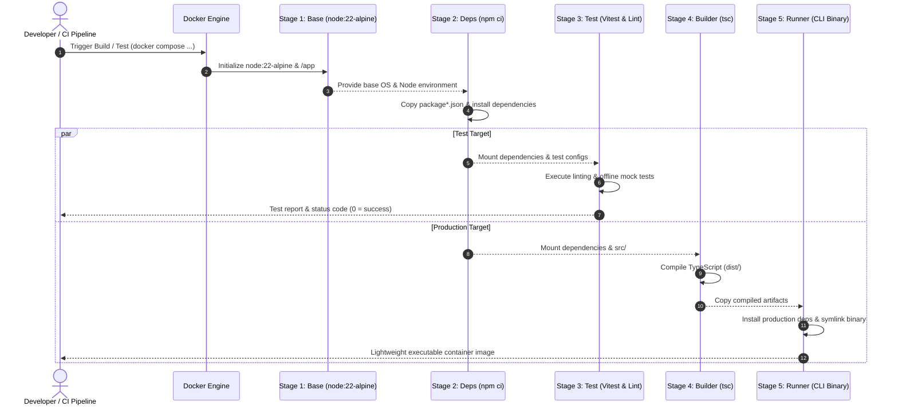

# Cloudflare CLI - Docker Guide

This guide documents the containerized architecture, testing workflows, and local offline execution for `cloudflare-cli`.

---

## Table of Contents
1. [Architecture Overview](#1-architecture-overview)
2. [Local Offline Mode (Zero Internet / Mock Testing)](#2-local-offline-mode-zero-internet--mock-testing)
3. [Docker Commands Cheat Sheet](#3-docker-commands-cheat-sheet)
4. [Services in `docker-compose.yml`](#4-services-in-docker-composeyml)
5. [Passing Environment Variables & Credentials](#5-passing-environment-variables--credentials)
6. [CI/CD Integration Example (GitHub Actions)](#6-cicd-integration-example-github-actions)
7. [Troubleshooting](#7-troubleshooting)

---

## 1. Architecture Overview

### Multi-Stage Build & Execution Sequence



---

## 2. Local Offline Mode (Zero Internet / Mock Testing)

The CLI includes a built-in **Local Mode** that simulates all Cloudflare API interactions in-memory. This allows developers to test the CLI inside Docker without internet connectivity, API tokens, or active Cloudflare subscriptions.

### Activating Local Mode in Docker:
You can activate Local Mode using either the `--local` / `-l` flag or the `CLOUDFLARE_LOCAL_MODE=true` environment variable:

```bash
# Test 'user:display' offline in container
docker compose run --rm -e CLOUDFLARE_LOCAL_MODE=true cli user:display

# Test 'zones list' offline in container
docker compose run --rm cli --local zones list

# Test 'dns list' offline with JSON output
docker compose run --rm cli -l -o json dns list -z mock-zone-001

# Test 'workers list' offline
docker compose run --rm cli --local workers list -a mock-acc-001
```

---

## 3. Docker Commands Cheat Sheet

| Task | Command | npm Shortcut |
| :--- | :--- | :--- |
| **Build Images** | `docker compose build` | `npm run docker:build` |
| **Run Tests (Offline)** | `docker compose run --rm test` | `npm run docker:test` |
| **Run Lint + Tests** | `docker compose run --rm test-all` | `npm run docker:test:all` |
| **Run CLI Help** | `docker compose run --rm cli --help` | `npm run docker:cli -- --help` |
| **Run CLI Local Mode** | `docker compose run --rm cli --local <cmd>` | `npm run docker:cli -- --local <cmd>` |
| **Run CLI Live (with .env)** | `docker compose run --rm cli <cmd>` | `npm run docker:cli -- <cmd>` |
| **Interactive Shell in Dev Container** | `docker compose run --rm dev sh` | - |
| **Clean Docker Resources** | `docker compose down --rmi local --volumes` | - |

---

## 4. Services in `docker-compose.yml`

```yaml
services:
  # 1. Test runner: executes unit/integration tests
  test:
    build:
      context: .
      target: test
    command: npm test
    environment:
      - NODE_ENV=test
      - CLOUDFLARE_LOCAL_MODE=true

  # 2. Test & lint combined
  test-all:
    build:
      context: .
      target: test
    command: sh -c "npm run lint && npm test"
    environment:
      - NODE_ENV=test
      - CLOUDFLARE_LOCAL_MODE=true

  # 3. Interactive Development container with volume mount
  dev:
    build:
      context: .
      target: deps
    volumes:
      - .:/app
      - /app/node_modules
    command: npm run dev -- --help

  # 4. Production CLI Runner
  cli:
    build:
      context: .
      target: runner
```

---

## 5. Passing Environment Variables & Credentials

### Live API Mode
To target real Cloudflare infrastructure inside Docker:
1. Ensure `.env` contains your credentials:
   ```ini
   CLOUDFLARE_API_TOKEN=your_real_api_token
   CLOUDFLARE_ACCOUNT_ID=your_real_account_id
   CLOUDFLARE_ZONE_ID=your_real_zone_id
   ```
2. Run the command:
   ```bash
   docker compose run --rm cli zones list
   ```

### Overriding via Command Line
```bash
docker compose run --rm \
  -e CLOUDFLARE_API_TOKEN=abc123token \
  -e CLOUDFLARE_ZONE_ID=zone999 \
  cli dns list
```

---

## 6. CI/CD Integration Example (GitHub Actions)

Add this workflow to `.github/workflows/docker-test.yml`:

```yaml
name: Docker CI

on:
  push:
    branches: [ main ]
  pull_request:
    branches: [ main ]

jobs:
  docker-test:
    runs-on: ubuntu-latest
    steps:
      - uses: actions/checkout@v4

      - name: Build Docker test image
        run: docker compose build test

      - name: Run isolated offline tests
        run: docker compose run --rm test-all
```

---

## 7. Troubleshooting

### `dial unix /var/run/docker.sock: connect: no such file or directory`
- **Cause**: Docker Desktop is not started on your machine.
- **Fix**: Launch Docker Desktop and verify with `docker info`.

### `Local mode output vs live API output`
- In Local Mode, mock IDs (e.g. `mock-zone-001`, `mock-dns-001`) are returned.
- To use live API, omit `--local` and provide a valid `CLOUDFLARE_API_TOKEN`.
