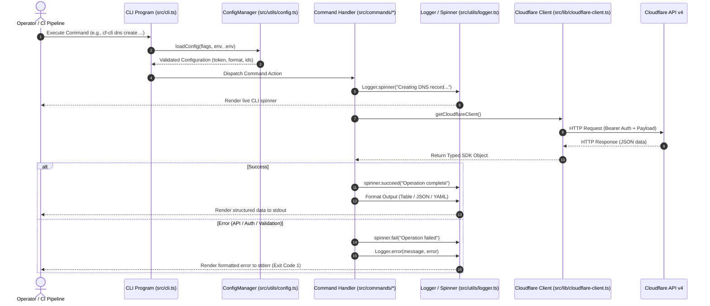

# cloudflare-cli

A modern, fast, and feature-complete Command-Line Interface for managing Cloudflare services (DNS, Zones, Workers, KV, R2, Cache, and Security). Built with TypeScript (ES Modules), Commander.js, and the official Cloudflare Node.js SDK v4.

---

## Table of Contents
- [How the CLI Works](#how-the-cli-works)
  - [Execution Lifecycle](#execution-lifecycle)
  - [Authentication & Configuration Resolution](#authentication--configuration-resolution)
  - [Output Formatting Engine](#output-formatting-engine)
- [Global Options & Flags](#global-options--flags)
- [Command Reference](#command-reference)
  - [1. Authentication & Identity (`auth`, `user:display`)](#1-authentication--identity-auth-userdisplay)
  - [2. Zones Management (`zones`)](#2-zones-management-zones)
  - [3. DNS Management (`dns`)](#3-dns-management-dns)
  - [4. Cloudflare Workers (`workers`)](#4-cloudflare-workers-workers)
  - [5. Workers KV (`kv`)](#5-workers-kv-kv)
  - [6. R2 Object Storage (`r2`)](#6-r2-object-storage-r2)
- [Execution Modes](#execution-modes)
  - [Development Mode (Host)](#development-mode-host)
  - [Production Binary Mode](#production-binary-mode)
  - [Docker Containerized Mode](#docker-containerized-mode)
  - [CI/CD & Shell Scripting with `jq`](#cicd--shell-scripting-with-jq)
- [Testing & Quality Verification](#testing--quality-verification)
- [Project Documentation & Agentic Framework](#project-documentation--agentic-framework)

---

## How the CLI Works

`cloudflare-cli` acts as an extensible bridge between terminal operators / CI/CD systems and Cloudflare's REST API v4.

### Execution Lifecycle



### Authentication & Configuration Resolution
The CLI determines credentials and defaults using a strict hierarchy (highest precedence first):
1. **Explicit CLI Flags**: e.g. `--token <TOKEN>`, `--zone <ZONE_ID>`, `--account <ACCOUNT_ID>`
2. **Environment Variables**: `CLOUDFLARE_API_TOKEN`, `CLOUDFLARE_ACCOUNT_ID`, `CLOUDFLARE_ZONE_ID`
3. **Local `.env` File**: Auto-loaded from current working directory via `dotenv`

### Output Formatting Engine
All commands support the `-o, --output` flag:
- `table` *(default)*: Formatted ASCII tables with selective columns for readability.
- `json`: Machine-readable JSON output ideal for piping to `jq`, bash scripts, or CI/CD pipelines.

---

## Global Options & Flags

These options are available on all subcommands:

| Flag | Long Flag | Description | Default |
| :--- | :--- | :--- | :--- |
| `-t` | `--token <token>` | Cloudflare API Token | `$CLOUDFLARE_API_TOKEN` |
| `-a` | `--account <accountId>` | Cloudflare Account ID | `$CLOUDFLARE_ACCOUNT_ID` |
| `-z` | `--zone <zoneId>` | Cloudflare Zone ID | `$CLOUDFLARE_ZONE_ID` |
| `-o` | `--output <format>` | Output format (`table`, `json`, `yaml`, `csv`) | `table` |
| `-l` | `--local` | Run in offline mock mode (no internet / token needed) | `false` |
| `-v` | `--verbose` | Enable verbose debug logs and stack traces | `false` |
| `-V` | `--version` | Display the CLI version | - |
| `-h` | `--help` | Display command help and usage info | - |

---

## Command Reference

### 0. Help & Command Discovery (`help`)

Get categorized command overviews, quickstart guides, and practical examples:

```bash
# View complete categorized command catalog and quickstart examples
cloudflare-cli help

# View in-depth usage, options, and examples for a specific command
cloudflare-cli help dns
cloudflare-cli help zones
cloudflare-cli help auth
cloudflare-cli help workers
cloudflare-cli help kv
cloudflare-cli help r2
```

---

### 1. Authentication & Identity (`auth`, `user:display`)

Manage and verify your Cloudflare credentials.

#### Verify API Token
Tests whether the configured API Token is active and valid.
```bash
cloudflare-cli auth verify
```
*Output:*
```text
✔ API Token is valid!
ℹ Token ID: 7b84...
ℹ Status: active
```

#### View Authenticated Identity (`user:display`)
Displays account owner details, user ID, country, and 2FA status (alias: `whoami`).
```bash
cloudflare-cli user:display
```
*Output:*
```text
✔ User details fetched successfully
ℹ User ID: 3e98f...
ℹ Name: John Doe
ℹ Country: US
ℹ 2FA Enabled: Yes
ℹ Suspended: No
```

---

### 2. Zones Management (`zones`)

Manage domains and zones associated with your Cloudflare account.

#### List Zones
Lists all zones with their status, plan tier, and account affiliation.
```bash
# List all zones
cloudflare-cli zones list

# Filter by domain name
cloudflare-cli zones list --name example.com

# Filter by status
cloudflare-cli zones list --status active
```
*Table Output:*
```text
┌─────────┬───────────────────┬──────────┬────────┬──────────────┐
│ ID      │ Name              │ Status   │ Plan   │ Account      │
├─────────┼───────────────────┼──────────┼────────┼──────────────┤
│ 9a8c... │ example.com       │ active   │ Pro    │ Production   │
│ 1b2c... │ staging-app.io    │ active   │ Free   │ Staging      │
└─────────┴───────────────────┴──────────┴────────┴──────────────┘
```

#### Get Zone Details
Retrieves full details for a single zone, including nameservers.
```bash
cloudflare-cli zones get <zoneId>
```

---

### 3. DNS Management (`dns`)

Manage DNS records for your domains (A, AAAA, CNAME, TXT, MX, etc.).

#### List DNS Records
```bash
# List all records for a zone
cloudflare-cli dns list --zone <zoneId>

# Filter by record type (A, CNAME, TXT)
cloudflare-cli dns list -z <zoneId> --type A

# Filter by record hostname
cloudflare-cli dns list -z <zoneId> --name api.example.com
```
*Table Output:*
```text
┌─────────┬───────┬─────────────────┬─────────────┬─────────┬──────┐
│ ID      │ Type  │ Name            │ Content     │ Proxied │ TTL  │
├─────────┼───────┼─────────────────┼─────────────┼─────────┼──────┤
│ d4e1... │ A     │ api.example.com │ 192.0.2.1   │ Yes     │ Auto │
│ e5f2... │ CNAME │ www.example.com │ example.com │ Yes     │ Auto │
│ f6a3... │ TXT   │ example.com     │ v=spf1 ...  │ No      │ Auto │
└─────────┴───────┴─────────────────┴─────────────┴─────────┴──────┘
```

#### Create a DNS Record
```bash
# Create an A record proxied through Cloudflare (Orange Cloud)
cloudflare-cli dns create \
  --zone <zoneId> \
  --type A \
  --name api.example.com \
  --content 192.0.2.1 \
  --proxied

# Create a CNAME record without proxy
cloudflare-cli dns create \
  -z <zoneId> \
  -t CNAME \
  -n blog.example.com \
  -c custom.hashnode.network
```

#### Delete a DNS Record
```bash
cloudflare-cli dns delete <recordId> --zone <zoneId>
```

---

### 4. Cloudflare Workers (`workers`)

Manage serverless Cloudflare Workers scripts.

#### List Worker Scripts
```bash
cloudflare-cli workers list --account <accountId>
```
*Table Output:*
```text
┌─────────────────┬──────────────────────────┬──────────────────────────┬────────────┐
│ ID              │ Created                  │ Modified                 │ UsageModel │
├─────────────────┼──────────────────────────┼──────────────────────────┼────────────┤
│ auth-service    │ 2026-01-15T10:20:00.000Z │ 2026-09-01T12:00:00.000Z │ standard   │
│ image-resizer   │ 2026-03-22T08:15:30.000Z │ 2026-08-14T09:30:00.000Z │ standard   │
└─────────────────┴──────────────────────────┴──────────────────────────┴────────────┘
```

---

### 5. Workers KV (`kv`)

Manage globally distributed key-value storage namespaces.

#### List KV Namespaces
```bash
cloudflare-cli kv list --account <accountId>
```
*Table Output:*
```text
┌──────────────────────────────────┬─────────────────┬─────────────────┐
│ ID                               │ Title           │ SupportsURLKeys │
├──────────────────────────────────┼─────────────────┼─────────────────┤
│ 4f3b5a19c82049e29a83419082acde12 │ USER_SESSIONS   │ Yes             │
│ 8a9b2c3d4e5f6a7b8c9d0e1f2a3b4c5d │ CONFIG_CACHE    │ Yes             │
└──────────────────────────────────┴─────────────────┴─────────────────┘
```

---

### 6. R2 Object Storage (`r2`)

Manage S3-compatible Cloudflare R2 storage buckets without egress fees.

#### List R2 Buckets
```bash
cloudflare-cli r2 list --account <accountId>
```
*Table Output:*
```text
┌──────────────────┬──────────────────────────┬──────────┐
│ Name             │ CreationDate             │ Location │
├──────────────────┼──────────────────────────┼──────────┤
│ prod-assets      │ 2026-02-10T14:32:00.000Z │ default  │
│ backup-snapshots │ 2026-04-05T18:22:15.000Z │ default  │
└──────────────────┴──────────────────────────┴──────────┘
```

---

## Execution Modes

### Development Mode (Host)
Execute commands directly against TypeScript source code using `tsx`:
```bash
npm run dev -- auth verify
npm run dev -- zones list
npm run dev -- dns list -z <zoneId>
```

### Production Binary Mode
Build and install the compiled executable:
```bash
# Build the project
npm run build

# Run via npm start
npm start -- user:display

# Or link globally to run 'cloudflare-cli' anywhere
npm link
cloudflare-cli --version
```

### Docker Containerized Mode
Run and test the CLI inside an isolated Alpine container environment:

```bash
# 1. Build the container images
npm run docker:build

# 2. Run test suite inside Docker
npm run docker:test

# 3. Run full verification (linting + tests) inside Docker
npm run docker:test:all

# 4. Execute CLI commands inside Docker
docker compose run --rm cli user:display
docker compose run --rm cli zones list
docker compose run --rm cli dns list -z <zoneId>
```

### CI/CD & Shell Scripting with `jq`
Using `--output json` outputs pure, unformatted JSON payloads:

```bash
# Extract all active domain names using jq
cloudflare-cli zones list --output json | jq -r '.[].name'

# Extract DNS record IDs for a specific hostname
cloudflare-cli dns list -z $ZONE_ID --output json | jq -r '.[] | select(.name=="api.example.com") | .id'
```

---

## Testing & Quality Verification

- **Run Unit & Integration Tests**:
  ```bash
  npm test
  ```
- **Run Type Check / Lint**:
  ```bash
  npm run lint
  ```
- **Continuous Watch Mode**:
  ```bash
  npm run test:watch
  ```

---

## 📦 Installation & Releases (GitHub Releases & GitHub Packages)

Every release of `cloudflare-cli` is published directly to GitHub across all major channels:

### 1. Install via GitHub Packages (NPM)
Install the CLI globally from the GitHub Packages npm registry:
```bash
# Install globally via GitHub Packages registry
npm install -g @vikaskumartank/cloudflare-cli --registry=https://npm.pkg.github.com

# Run anywhere
cloudflare-cli --help
cf-cli user:display
```

### 2. Run via GitHub Container Registry (Docker)
Pull and execute directly from GitHub Packages (GHCR) without needing Node.js installed:
```bash
# Execute directly from GHCR
docker run --rm -it \
  -e CLOUDFLARE_API_TOKEN="your_token_here" \
  ghcr.io/vikaskumartank/cloudflare-cli:latest user:display

# Or run in offline mock mode
docker run --rm -it ghcr.io/vikaskumartank/cloudflare-cli:latest --local user:display
```

### 3. Download from GitHub Releases
Pre-compiled distributions are published under the repository's **Releases** tab:
- **macOS Installer (`.dmg`)**: Open the DMG and run `./install.sh` for 1-click global terminal setup.
- **Standalone Tarball (`.tar.gz`)**: Extract and run with bundled dependencies on macOS or Linux.
- **NPM Package Tarball (`.tgz`)**: Offline installable via `npm install -g <filename>.tgz`.

```bash
# Generate artifacts locally
npm run package

# Artifacts created in build_artifacts/:
# - cloudflare-cli-v0.1.0-macos.dmg (macOS Installer DMG)
# - cloudflare-cli-v0.1.0-package.tar.gz (Standalone package)
# - vikaskumartank-cloudflare-cli-0.1.0.tgz (NPM package)
```

**Automated CI/CD**: The GitHub Actions workflow in [`.github/workflows/package-and-release.yml`](.github/workflows/package-and-release.yml) automatically builds and publishes the DMG, Standalone Tarball, GitHub Packages (NPM registry), and GitHub Container Registry (Docker image) when a tag is pushed or triggered manually.

---

## Project Documentation & Agentic Framework

- [Developer & Testing Guide (Local & Docker)](DEVELOPER_GUIDE.md)
- [Docker Architecture & Commands Guide](DOCKER.md)
- [Master Execution Roadmap](docs/plans/00-master-roadmap.md)
- [Phase 1 MVP Specification](docs/plans/01-phase-1-mvp-spec.md)
- [System Architecture & Data Flow](docs/architecture/system-design.md)
- [Authentication & Security Architecture](docs/architecture/auth-and-security.md)
- [Cloudflare API v4 Reference](docs/research/cloudflare-api-v4-reference.md)
- [Antigravity AGY Agent Guidelines](AGENTS.md)

---

## License
MIT
