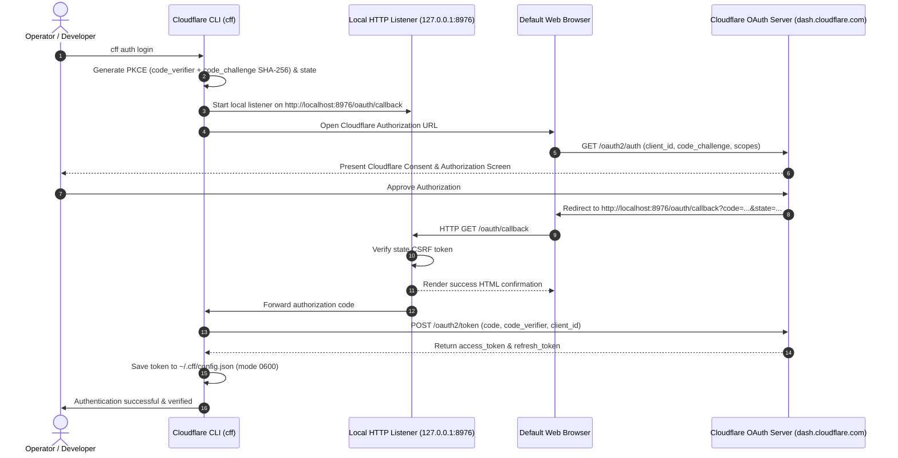

# Authentication & Security Architecture

## 1. Threat Model & Principles
- **Credential Protection**: API tokens grant powerful access to DNS and Cloudflare infrastructure. Under no condition should tokens be committed to git, logged to console, or written to public files.
- **Least Privilege Principle**: Recommend API Tokens scoped exclusively to specific zones and permissions instead of Global API Keys.
- **Safe Defaults**: Destructive commands require explicit flags or confirmations.
- **Local Storage Security**: User credentials stored in `~/.cff/config.json` are created with directory permissions `0700` and file permissions `0600` (readable/writable only by current OS user).

---

## 2. Token Resolution Order
When any command executes, tokens are resolved in the following strict precedence:
1. **CLI Argument**: `--token <TOKEN>`
2. **Environment Variable**: `CLOUDFLARE_API_TOKEN`
3. **Stored User Configuration**: `~/.cff/config.json` (from `cff auth login` or `cff auth verify --code`)
4. **Local `.env` file**: Located in current working directory
5. **Offline Mock Mode**: Active when `--local` flag is provided

---

## 3. OAuth 2.0 Authorization Code Flow with PKCE
The CLI supports RFC 7636 Authorization Code Flow with Proof Key for Code Exchange (PKCE):

---

## 4. Headless & SSH Server Fallback
For environments where a local browser cannot be opened (e.g., remote SSH sessions or Docker containers), `cff auth login --manual` provides a terminal-friendly copy-paste flow:
1. CLI prints authorization URL to standard output.
2. User opens the link in their local browser.
3. User authorizes and pastes the authorization code into the CLI prompt.
4. CLI completes the PKCE exchange and saves credentials securely.
