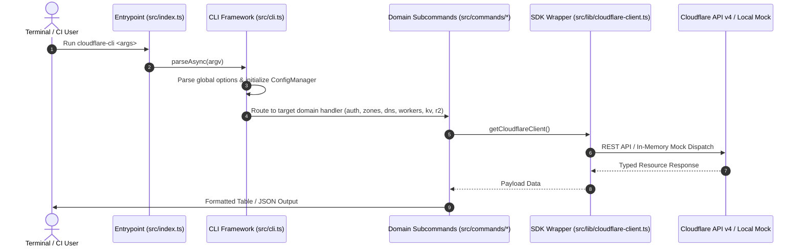
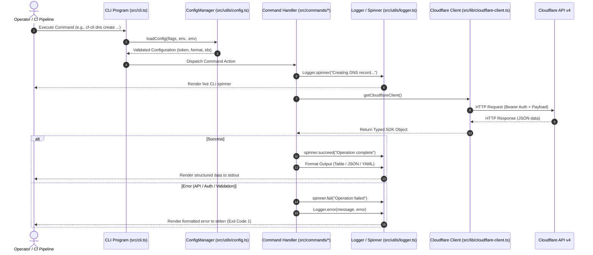

# System Architecture Design

## 2. Key Subsystems
- **Config & Auth**: Manages credentials, tokens, environment variables with strict runtime validation.
- **Output Formatter**: Generates human-friendly tables or machine-parseable JSON/YAML.
- **Logger & Spinner**: Asynchronous feedback loop preventing deadlocks or silent pauses.
- **Command Modules**: Self-contained directories exposing domain commands.

---

## 3. Command Execution Sequence

